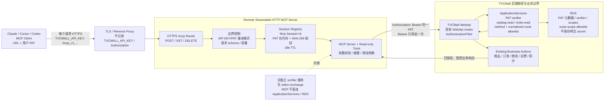
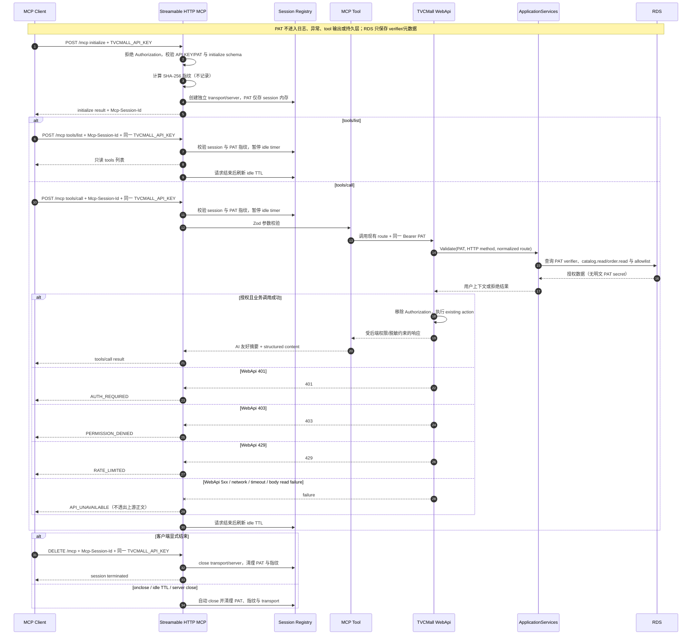

# TVCMall 远程 Streamable HTTP MCP 技术架构

本文是 TVCMall Customer MCP v0.1 的远程部署、认证授权、会话与数据流参考。MCP 调用 WebApi 的授权细节以根目录 `tvcmall-webapi mcp开发接入说明文档.md` 为准。

唯一授权链路是：MCP Client 在每个远程 `/mcp` 请求携带 `TVCMALL_API_KEY: tmcp_v1_{tokenId}.{secret}`；MCP Server 仅做基本边界控制，再以 `Authorization: Bearer <PAT>` 调用现有 TVCMall WebApi route；WebApi → ApplicationServices → RDS 完成 PAT verifier、scope 和 route allowlist 授权。链路中没有独立认证服务或 token exchange。

## 1. 设计目标

- 客户只需配置远程 MCP URL 与 PAT，不安装 npm 包、不运行本地登录 CLI。
- 使用 MCP Streamable HTTP 的 `POST`、`GET`、`DELETE /mcp` 与 `Mcp-Session-Id` 管理会话。
- 每个 session 有独立 MCP Server、transport、原始 PAT 内存上下文和 SHA-256 指纹。
- MCP 不解析用户、scopes 或 expiry；业务授权只有 WebApi 后端能够决定。
- 复用现有商品、订单、物流、运费和积分 WebApi routes，不新增 MCP 专用业务 routes。
- 全链路避免 PAT、完整上游响应和非必要 PII 进入日志、异常或 tool 输出。

## 2. 技术架构图



授权边界位于 TVCMall WebApi、ApplicationServices 与 RDS。MCP Server 不会因为 PAT 格式有效就声称用户已通过 WebApi 验证，也不能通过本地 scope 规则放行请求。

## 3. 组件职责与信任边界

| 组件 | 职责 | 可接触的凭据 | 不允许做的事 |
| --- | --- | --- | --- |
| MCP Client | 保存 URL/PAT；每个 `/mcp` 请求发送 PAT 与适用的 session ID | 用户 PAT | 把 PAT 写入共享配置、仓库或对话 |
| TLS / Reverse Proxy | TLS 终止、路由、接入限流 | 请求头短暂经过 | 记录 `TVCMALL_API_KEY`、`Authorization` 或请求正文中的敏感数据 |
| MCP HTTP Router | method/path、API KEY/PAT 基本格式、JSON/schema、容量控制 | 当前请求 PAT | 接收入站 `Authorization`、调用独立验证端点、解析用户/scopes/expiry |
| Session Registry | 绑定 `Mcp-Session-Id`、PAT 指纹、transport 和 idle TTL | 原始 PAT 与 SHA-256 指纹，仅内存 | 持久化、跨 session 共享或记录 PAT/指纹 |
| MCP Tools | 输入校验、调用 WebApi、输出摘要、错误转换 | 当前 session PAT | 本地判断 scope、直连 ApplicationServices/RDS、透出上游正文 |
| TVCMall WebApi | 识别 PAT、建立用户上下文、执行现有 route | PAT 在认证过滤器中短暂可见 | 将 `Authorization` 继续泄漏给业务层 |
| ApplicationServices | PAT verifier、有效性检查、scope 与 route allowlist | PAT 校验所需数据 | 改变网站登录流程或让 MCP 绕过 allowlist |
| RDS | 保存 PAT 元数据/verifier/scopes 与 route-scope allowlist | 不可逆 verifier | 保存 PAT 明文 secret |

信任边界有三层：公网客户端到 TLS 边缘、边缘到 MCP 服务、MCP 服务到 TVCMall WebApi。ApplicationServices 和 RDS 只在 TVCMall 后端内部，由 WebApi 访问。

## 4. 部署拓扑与关键配置

```text
Internet MCP Client
  -> HTTPS :443
TVCMall Load Balancer / Reverse Proxy
  -> private HTTP/TLS, restricted security group
Remote MCP Server replicas
  -> production/staging: HTTPS outbound allowlist only
  -> sandbox: loopback/RFC1918 HTTP or HTTPS
TVCMall WebApi
  -> internal ApplicationServices -> RDS
```

MCP session 只存在于单个进程内存。多副本部署需要在负载均衡层按 session 保持粘性；服务重启或实例移除后，客户端应重新 initialize。不要通过共享数据库复制原始 PAT 来实现 session 漂移。

| 配置 | 要求 |
| --- | --- |
| `TVCMALL_WEBAPI_BASE_URL` | 必填；包含现有 WebApi 基础路径（示例 `/api`）；`production` / `staging` 必须 HTTPS，只有 `sandbox` 可使用受限 loopback/RFC1918 HTTP；无 userinfo、query、fragment |
| `TVCMALL_API_TIMEOUT_MS` | WebApi 超时；默认 15000 ms；合法范围 `1..2_147_483_647` ms |
| `TVCMALL_API_ENV` | 默认 `production`；可为 `production`、`staging`、`sandbox`；缺失或非法值回退 `production` |
| `TVCMALL_MCP_HOST` | 默认 `127.0.0.1`；生产监听范围与反向代理拓扑一致 |
| `TVCMALL_MCP_PORT` | 默认 `3000` |
| `TVCMALL_MCP_PATH` | 默认 `/mcp`；不得带 query/fragment |
| `maxSessions` | 进程最大活跃与并发初始化 session 数；默认 1000 |
| `sessionIdleTtlMs` | session 空闲清理时间；默认 30 分钟 |

部署环境不配置共享 PAT。健康检查 `GET /healthz` 只返回服务存活状态，不返回配置、session、PAT 或后端身份。

`HTTPS` 在所有合法 `TVCMALL_API_ENV` 中可用，且 `production`、`staging`（以及缺失或非法值回退后的 `production`）强制 HTTPS。只有显式 `sandbox` 可使用 HTTP，hostname 仅限 `localhost`、`[::1]`、`127.0.0.0/8` 或 RFC1918 的 `10.0.0.0/8`、`172.16.0.0/12`、`192.168.0.0/16`。实现不解析 DNS；普通 hostname、公网、link-local、CGNAT 和非 loopback IPv6 HTTP 目标均拒绝，所有 URL 仍拒绝 userinfo、query 和 fragment。此例外只服务隔离网络的本地联调和可撤销测试 PAT，不放宽 MCP Client 入站 HTTPS/TLS 或生产 PAT 的边界。

`TVCMALL_API_TIMEOUT_MS` 默认 `15000` ms，合法范围为 `1..2_147_483_647` ms；非法或超限值回退到默认值。该 deadline 覆盖等待 response headers 与读取 JSON body；超时映射为 `API_UNAVAILABLE`。

## 5. 数据流转图



初始化不会向 WebApi 发起预验证。PAT 是否有效、过期或已撤销，只有在业务 tool 调用现有 WebApi route 时才能确定。

## 6. 会话生命周期

1. 客户端在无 `Mcp-Session-Id` 的 `POST /mcp initialize` 中发送 `TVCMALL_API_KEY`；入站 `Authorization` 不受支持。
2. MCP 校验基本格式、计算 SHA-256 指纹并创建独立 session；原始 PAT 与指纹都只在内存。
3. 后续 `POST`、`GET`、`DELETE /mcp` 必须携带相同 `TVCMALL_API_KEY` 和 `Mcp-Session-Id`。
4. 未知 session 返回 `404 SESSION_NOT_FOUND`；PAT 指纹不一致返回 `401 AUTH_REQUIRED`，两者都不泄露归属。
5. active request 期间暂停 idle 计时；请求结束后刷新 idle TTL。
6. `DELETE`、transport `onclose`、idle TTL、初始化失败或 server close 都关闭 transport/MCP Server，并删除原始 PAT、指纹和 session 引用。

指纹不是认证凭据，也不能用于调用 WebApi 或跨实例恢复 session。

## 7. WebApi 路由与授权

MCP 用同一 PAT 复用现有 routes。WebApi 授权匹配维度为：

```text
UPPERCASE_HTTP_METHOD + normalized_route -> required_scope
```

`normalized_route` 去掉 scheme/host/query 和首尾 `/`，再转为小写。route 未登记、被禁用或 PAT 缺少所需 scope 都返回 `403`。

| 能力 | 典型现有 route | Scope |
| --- | --- | --- |
| 商品搜索 | `GET /api/v3/product/list/search/mapping` | `catalog.read` |
| 商品详情 | `GET /api/v3/productdetail/detail` | `catalog.read` |
| 商品运费估算 | `GET /api/v3/productdetail/shipping/compute` | `catalog.read` |
| 订单列表 | `POST /api/v3/user/getorders` | `order.read` |
| 订单详情 | `POST /api/v3/order/detail` | `order.read` |
| 物流与订单运费 | `GET /api/order/getlogisticstracking` | `order.read` |
| 积分汇总 | `GET /api/v3/user/points/stat` | `order.read` |

新 tool 上线前必须由 WebApi/ApplicationServices 团队确认 method、normalized route、scope 与 allowlist enabled 状态。MCP 侧的 tool 列表不是授权来源。

## 8. 错误、安全与可观测性

| 来源 | 稳定错误 | 安全响应 |
| --- | --- | --- |
| MCP 请求缺少/无效 `TVCMALL_API_KEY`，或携带入站 `Authorization` | `AUTH_REQUIRED` | HTTP 401，不回显 header/token |
| WebApi `401` | `AUTH_REQUIRED` | 提示重新配置 PAT，不区分具体失效原因 |
| WebApi `403` | `PERMISSION_DENIED` | 提示 scope/route allowlist 不足 |
| WebApi `429` | `RATE_LIMITED` | 仅透出安全的重试提示 |
| WebApi `5xx`、网络、超时、正文读取失败 | `API_UNAVAILABLE` | 不透出上游正文，不归因于 PAT |
| MCP SDK 输入 schema 不合法 | `Invalid params`（`-32602`） | handler 前拒绝，不进入 WebApi；不属于项目 WebApi 稳定码 |

输入 schema 由 MCP SDK 在 tool handler 前校验；不合法输入按 JSON-RPC `Invalid params`（`-32602`）拒绝，不进入 WebApi，也不属于项目的 WebApi 稳定错误码。该错误不得泄露 PAT 或堆栈。

日志可记录 request ID、tool name、HTTP status、耗时、route template 与 session 计数，但不得记录入站 `TVCMALL_API_KEY`、出站 `Authorization`、PAT、PAT 指纹、完整 URL query、请求/响应正文或 PII。错误对象与 tracing attributes 也执行同一脱敏策略。

`tvcmall_auth_status` 只返回：

```json
{
  "configured": true
}
```

该结果只说明当前 session 有 PAT，不说明 WebApi 已完成验证。

## 9. 接入示例

MCP Client 配置：

```json
{
  "mcpServers": {
    "tvcmall": {
      "url": "https://mcp.example.com/mcp",
      "headers": {
        "TVCMALL_API_KEY": "tmcp_v1_{tokenId}.{secret}"
      }
    }
  }
}
```

MCP Server 调用 WebApi 的伪代码：

```ts
const response = await fetch(`${webApiBaseUrl}${existingRoute}`, {
  ...init,
  headers: {
    ...init.headers,
    Accept: 'application/json',
    Authorization: `Bearer ${session.pat}`,
  },
});
```

示例 URL 由部署方替换；真实 PAT 应由 MCP Client secret 管理能力注入。`session.pat` 必须从当前 MCP 请求建立的 session 上下文读取，不能来自服务器环境变量。WebApi `Authorization` 组装必须防止已有 `Bearer ` 再次加前缀。

## 10. 验收清单

- [ ] 每个 `/mcp` 请求都有 `TVCMALL_API_KEY`；初始化后还有 `Mcp-Session-Id`，旧入站 `Authorization` 被拒绝。
- [ ] 缺失/格式错误 PAT、替换 PAT、未知 session 和容量超限均有测试。
- [ ] 不同 session 使用独立 MCP Server、transport、PAT 与指纹。
- [ ] `DELETE`、`onclose`、idle TTL、初始化失败和 server close 均清理 session。
- [ ] WebApi base URL 必填且拒绝 userinfo/query/fragment；`production` / `staging` 强制 HTTPS，HTTP 只允许显式 `sandbox` 的 loopback/RFC1918 host。
- [ ] MCP 调用的是现有 WebApi routes，并原样使用同一 PAT、只增加一次 `Bearer `。
- [ ] ApplicationServices/RDS 执行 PAT verifier、`catalog.read` / `order.read` 与 route-scope allowlist。
- [ ] MCP 不直连 ApplicationServices/RDS，不调用额外认证端点，不交换 token，不做本地 scope 判断。
- [ ] WebApi 401/403/429/5xx、网络、超时和 body read failure 的稳定映射均有覆盖。
- [ ] `tvcmall_auth_status` 只有 configured 字段，不暗示已验证。
- [ ] 日志、异常、tracing、tool 输出、fixtures 与测试快照不含真实 PAT 或 PII。
- [ ] 对外 tools 仅覆盖商品、订单、物流、运费和积分只读能力，不提供文件导出或写操作。
