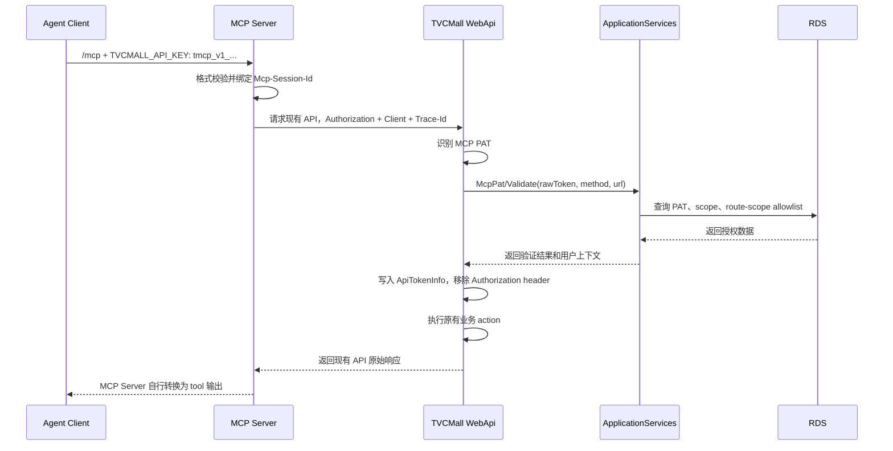

# TVCMall WebApi MCP 开发接入说明文档

更新时间：2026-07-23

## 1. 适用范围

本文面向开发 TVCMall 远程 Streamable HTTP MCP Server 的工程人员，说明 MCP Client 到 MCP Server，以及 MCP Server 调用 `tvcmall-webapi` 时的认证授权方式。

本期方案不改造 MCP 协议本身，不新增 OAuth Gateway，不新增独立 OAuth 服务，也不改变 TVCMall PC/Mobile/SSR 当前网站登录流程。MCP Client 使用自定义 Header 提交每个用户独立的 PAT；MCP Server 再按 WebApi 既有 Bearer 规范调用 API。

## 2. 接入结论

每个 MCP Client 使用 TVCMall 为当前用户签发的 PAT（Personal Access Token）访问 MCP Server：

```http
TVCMALL_API_KEY: tmcp_v1_{tokenId}.{secret}
```

MCP Server 调用 TVCMall WebApi 时，将同一 PAT 转为：

```http
Authorization: Bearer tmcp_v1_{tokenId}.{secret}
```

核心规则：

- MCP Server 不使用 OAuth，不使用网站用户名密码，不直接访问 ApplicationServices 或 RDS。
- Agent Client 在每个 `/mcp` 请求的 `TVCMALL_API_KEY` Header 中发送当前用户的 PAT；每个用户使用不同 PAT。
- MCP Server 只从当前 MCP session 内存读取 PAT，不配置或读取供所有用户共享的 PAT。
- MCP Server 只调用现有 WebApi URL；TVCMall WebApi、ApplicationServices 和 RDS 都是本仓库之外的现有系统，本仓库不实现它们。
- WebApi 优先识别 `tmcp_v1_` Bearer PAT，调用 ApplicationServices 做 PAT 校验和 route-scope 授权。
- 授权通过后，WebApi 继续执行原有业务 API，返回值保持现有 API 原样，不做 MCP 格式包装。
- 授权失败时，不进入业务 action，由 WebApi 直接返回 `401` 或 `403`。
- 本期只支持 `catalog.read` 和 `order.read` 两个 scope。
- 不新增 `/api/mcp/v1/...` 业务路由，MCP Server 直接复用现有 WebApi route。

## 3. 角色与边界

| 角色 | 职责 | 不做什么 |
| --- | --- | --- |
| Agent Client | 保存用户配置的 MCP Server 地址和当前用户 PAT；每请求发送 `TVCMALL_API_KEY` | 不理解 TVCMall 网站 token，不直接访问 WebApi |
| MCP Server | 从当前 session 读取 PAT，根据 MCP tool 调用现有 TVCMall WebApi | 不创建 OAuth 流程，不直连 RDS，不保存 PAT verifier，不使用共享 PAT |
| TVCMall WebApi | 识别 PAT、调用 ApplicationServices 校验、写入请求用户上下文、执行现有 API | 不保存 pepper，不直连 MCP PAT RDS 表 |
| ApplicationServices | 验证 PAT，校验 route-scope allowlist | 不改变网站登录流程 |
| RDS | 保存 PAT 元数据、verifier、scope、route allowlist | 不保存 PAT 明文 secret |

代码入口参考：

- WebApi 认证过滤器：`TVCMall/WebApi/Filters/AuthenticationFilterAttribute.cs`
- WebApi MCP 授权适配：`TVCMall/WebApi/McpAuth/*`
- ApplicationServices MCP 授权核心：`ApplicationServices/Users.Basic/McpAuth/*`
- RDS 迁移脚本：`ApplicationServices/ApplicationServices.WebHost/DbMigrations/20260717153000_add_mcp_pat_auth_tables.sql`

## 4. 请求 Header 规范

### 4.1 MCP Client 到 MCP Server

除无需认证的 `GET /healthz` 外，每个 `POST`、`GET` 和 `DELETE /mcp` 请求都必须携带：

```http
TVCMALL_API_KEY: tmcp_v1_{tokenId}.{secret}
```

初始化成功后的请求还必须携带服务端返回的 `Mcp-Session-Id`，并继续发送同一 PAT。MCP 入站不接受 `Authorization` Header；仅发送旧的 `Authorization: Bearer ...`，或同时发送两种凭据，均返回 `401 AUTH_REQUIRED`。

### 4.2 MCP Server 到 WebApi

MCP Server 请求 WebApi 时必须带 PAT：

```http
Authorization: Bearer tmcp_v1_{tokenId}.{secret}
```

要求：

- `Authorization` scheme 必须是 `Bearer`。
- token 必须以 `tmcp_v1_` 开头。
- token 格式为 `tmcp_v1_{tokenId}.{secret}`。
- `{tokenId}` 是公开 token 标识，`{secret}` 是只出现一次的密钥部分。
- 不能使用普通网站登录 token 冒充 MCP PAT。

### 4.3 内容 Header

按现有 WebApi 接口要求设置：

```http
Accept: application/json
Content-Type: application/json
```

GET 接口通常不需要 `Content-Type`；POST/PUT/PATCH 接口按现有 API body 格式设置。

### 4.4 来源标识与授权诊断 Header

本期授权不依赖来源标识 Header，授权只看 PAT、scope 和 route-scope allowlist。

MCP Server 每次调用 WebApi 都会附加以下 header：

```http
X-TVCMall-MCP-Client: tvcmall-mcp-server
X-TVCMall-MCP-Trace-Id: {uuid}
```

注意：

- 这两个 header 只用于日志或排查，不作为授权依据，也不改变 route-scope allowlist。
- `X-TVCMall-MCP-Trace-Id` 是每个 WebApi 请求生成的 UUID，不得从 PAT、session ID、客户信息或请求参数派生。
- WebApi/ApplicationServices 必须在安全审计日志中记录 trace ID、HTTP method、normalized route、HTTP status 和授权决策，且不得记录 PAT、`Authorization`、请求参数、完整 URL/query、响应正文或 PII。
- 不要把历史 `request-source` Header 当成 MCP 授权条件。
- 即使入口网关保留 `request-source: external`，MCP PAT 分支也会先于旧网站 token 分支执行。

对于 MCP PAT 的 `403`，WebApi 可选返回一个仅含枚举值的 response header：

```http
X-TVCMall-MCP-Auth-Reason: scope_missing | route_not_registered | route_disabled
```

| 值 | 授权拒绝分类 |
| --- | --- |
| `scope_missing` | PAT 缺少目标 route 所需 scope |
| `route_not_registered` | method + normalized route 未登记到 allowlist |
| `route_disabled` | route 已登记但 `enabled=0` |

该 header 缺失时保持原有 `403` 行为；不得把 PAT、用户、scope 列表、数据库细节或原始异常放入 header。MCP 仅接受上表的精确值写入安全日志，未知值会被忽略。无论是否发送该 header，授权结果仍完全由 WebApi/ApplicationServices/RDS 决定。

## 5. 授权链路



WebApi 授权通过后会写入安全的请求上下文：

- `ApiTokenInfo.UserId` 使用 PAT 所属用户。
- `ApiTokenInfo.ClientId` 标识为 `mcp`。
- `ApiTokenInfo.TokenType` 标识为业务用户类型。
- `ApiTokenInfo.Permissions` 写入当前 PAT scopes。
- `Authorization` Header 会从 WebApi 请求对象中移除，避免继续向业务层或下游泄漏 PAT 明文。

## 6. MCP Server 调用 WebApi 示例

### 6.1 关键词搜索

```http
GET /api/v3/product/list/search/mapping?keywords=iphone&pageIndex=1&pageSize=20 HTTP/1.1
Host: {webapi-host}
Authorization: Bearer tmcp_v1_{tokenId}.{secret}
Accept: application/json
```

### 6.2 以图搜图

```http
POST /api/v3/product/list/search/image/mapping HTTP/1.1
Host: {webapi-host}
Authorization: Bearer tmcp_v1_{tokenId}.{secret}
Content-Type: application/json
Accept: application/json

{
  "imageUrl": "https://example.com/image.jpg"
}
```

### 6.3 订单只读接口

```http
POST /api/v3/user/getorders HTTP/1.1
Host: {webapi-host}
Authorization: Bearer tmcp_v1_{tokenId}.{secret}
Content-Type: application/json
Accept: application/json

{
  "pageIndex": 1,
  "pageSize": 20
}
```

### 6.4 物流信息查询

当前物流查询没有 V3 route，本期使用现有旧路由：

```http
GET /api/order/getlogisticstracking?orderId={orderId} HTTP/1.1
Host: {webapi-host}
Authorization: Bearer tmcp_v1_{tokenId}.{secret}
Accept: application/json
```

### 6.5 MCP Server 代码伪例

```ts
async function callTvcmallWebApi(pat: string, path: string, init: RequestInit = {}) {
  const traceId = crypto.randomUUID();
  const response = await fetch(`${process.env.TVCMALL_WEBAPI_BASE_URL}${path}`, {
    ...init,
    headers: {
      Accept: 'application/json',
      ...(init.headers || {}),
      Authorization: `Bearer ${pat}`,
      'X-TVCMall-MCP-Client': 'tvcmall-mcp-server',
      'X-TVCMall-MCP-Trace-Id': traceId
    }
  });

  if (response.status === 401) {
    throw new Error('TVCMall MCP PAT is invalid, expired, revoked, or unavailable.');
  }

  if (response.status === 403) {
    throw new Error('TVCMall MCP PAT does not have scope for this WebApi route.');
  }

  return response.json();
}
```

## 7. Scope 与 WebApi route 映射

授权由 RDS 表 `mcp_route_scope_allowlist` 控制，匹配维度是：

```text
HTTP Method + normalized_route -> required_scope
```

归一化规则：

- HTTP method 转为大写，例如 `GET`、`POST`。
- URL 如果是绝对地址，只取 path。
- 去掉 query string。
- 去掉首尾 `/`。
- path 转小写。

示例：

| 原始请求 | 归一化后 |
| --- | --- |
| `GET https://example.com/api/v3/product/list/search/mapping?keywords=iphone` | `GET + api/v3/product/list/search/mapping` |
| `POST /api/v3/user/getorders` | `POST + api/v3/user/getorders` |
| `GET /api/order/getlogisticstracking?orderId=123` | `GET + api/order/getlogisticstracking` |

授权结果：

- route 未登记到 allowlist：返回 `403`。
- route 已登记但 `enabled=0`：返回 `403`。
- PAT 不包含 route 要求的 scope：返回 `403`。
- PAT 无效、过期或已吊销：返回 `401`。

## 8. 本期默认 allowlist

本期只开放截图确认的只读类接口，初始数据随 RDS 迁移脚本写入。有 V3 route 的接口优先使用 V3；物流查询当前没有 V3，保留现有旧路由。

### 8.1 `catalog.read`

| Method | normalized_route | 说明 |
| --- | --- | --- |
| POST | `api/v3/product/list/search/image/mapping` | PC 以图搜图 |
| POST | `api/m/v3/product/list/search/image/mapping` | Mobile 以图搜图 |
| GET | `api/v3/product/list/search/mapping` | PC 关键词搜索 |
| GET | `api/m/v3/product/list/search/mapping` | Mobile 关键词搜索 |
| GET | `api/v3/productdetail/detail` | PC 商详页查询 |
| GET | `api/m/v3/productdetail/detail` | Mobile 商详页查询 |
| GET | `api/v3/productdetail/shipping/compute` | PC 运费试算 |
| GET | `api/m/v3/productdetail/shipping/compute` | Mobile 运费试算 |

### 8.2 `order.read`

| Method | normalized_route | 说明 |
| --- | --- | --- |
| POST | `api/v3/user/getorders` | PC 订单列表 / 订单管理 |
| POST | `api/m/v3/user/getorders` | Mobile 订单列表 / 订单管理 |
| POST | `api/v3/order/detail` | PC 订单详情查询 |
| POST | `api/m/v3/order/detail` | Mobile 订单详情查询 |
| POST | `api/v3/order/detail/page` | PC 订单详情商品分页 |
| POST | `api/m/v3/order/detail/page` | Mobile 订单详情商品分页 |
| GET | `api/order/getlogisticstracking` | PC 订单物流信息查询；无 V3 |
| GET | `api/m/order/getlogisticstracking` | Mobile 订单物流信息查询；无 V3 |
| GET | `api/v3/user/points/stat` | PC 查看积分汇总 |
| GET | `api/m/v3/user/points/stat` | Mobile 查看积分汇总 |
| GET | `api/v3/user/balance/list` | PC 查询余额流水 |
| GET | `api/m/v3/user/balance/list` | Mobile 查询余额流水 |

### 8.3 本期不开放

| 功能 | 处理方式 |
| --- | --- |
| 自然语言搜索（未上线） | 不登记独立 route；MCP Server 可先转换为关键词后调用 `product/list/search/mapping` |
| 分类导航、分类商品列表 | 不在本期截图范围内，不登记 `category/list`、`product/list/catalog` |
| 写接口 | 不开放积分转余额、设置运输方式、设置地址、支付、优惠券、导出、删除、复制订单等接口 |

新增 MCP tool 前必须先确认目标 WebApi route 已登记到 allowlist。未登记 route 默认拒绝，不允许靠 MCP Server 侧约定绕过。

## 9. 失败响应与 MCP Server 处理建议

### 9.1 业务 API 调用失败

| HTTP 状态 | 常见原因 | MCP Server 建议 |
| --- | --- | --- |
| 401 | PAT 缺失、格式错误、verifier 不匹配、过期、已吊销，或授权服务不可用 | 提示重新配置 PAT；不要自动重试大量请求 |
| 403 | route 未登记、route 已禁用、PAT scope 不足 | 提示需要申请对应 scope 或登记 route allowlist |
| 5xx | 现有业务 API 或 WebApi 内部异常 | 按现有 WebApi 故障处理，不归因于 PAT |

业务 API 的成功响应和失败响应都保持现有 WebApi 格式。MCP Server 如需返回 MCP tool 的统一结构，应在 MCP Server 内部转换，不要求 WebApi 改响应格式。

若 `403` 来自 MCP PAT 请求，WebApi 可按第 4.4 节返回 `X-TVCMall-MCP-Auth-Reason`。WebApi/ApplicationServices 运营人员应使用 MCP 日志中的 trace ID 查询同一条授权决策；MCP 不读取失败 response body，也不自行推断 scope 或 allowlist 状态。

## 10. 安全要求

- 每个用户的 PAT 由 MCP Client 提供，只能短暂保存在对应 MCP session 的进程内存中；MCP Server 不使用环境变量或部署 secret 配置共享 PAT。
- 日志、异常、链路追踪中必须脱敏入站 `TVCMALL_API_KEY`、出站 `Authorization` 和 `tmcp_v1_` token；可记录随机 trace ID、HTTP method、normalized route、HTTP status 和枚举授权拒绝分类。
- `DELETE /mcp`、transport `onclose`、idle TTL、initialize 失败或 server close 后必须清理 session PAT 与指纹。
- `TVCMALL_API_ENV=production` 或 `staging` 时，MCP Server 到 WebApi 必须使用 HTTPS；`HTTPS` 在所有环境均可使用。
- 只有显式 `TVCMALL_API_ENV=sandbox` 的隔离本地联调，才允许 HTTP WebApi URL，且 hostname 必须为 `localhost`、`[::1]`、`127.0.0.0/8` 或 RFC1918 地址段（`10.0.0.0/8`、`172.16.0.0/12`、`192.168.0.0/16`）。不得通过普通 hostname、公网、link-local、CGNAT 或非 loopback IPv6 使用 HTTP；URL 一律不得带 userinfo、query 或 fragment。
- `sandbox` HTTP 仅可配合隔离网络和可撤销测试 PAT，不可使用生产客户 PAT，也不改变 MCP Client 到 `/mcp` 的 HTTPS/TLS 要求。`TVCMALL_API_ENV` 未设置或非法时按 `production` 处理。
- 不要把 PAT 发送给除 TVCMall WebApi 之外的任何下游服务。
- 不要在 MCP Server 中保存 `mcp_pat_pepper`；pepper 只属于 ApplicationServices。
- `mcp_pat_pepper` 从 ApplicationServices 配置 `user.authentication.mcp_pat_pepper` 读取，不对 MCP Server 暴露。
- 生产、测试、开发环境使用不同 PAT 和不同 pepper。
- PAT 泄漏时立即停止使用该 PAT，并按 TVCMall 内部凭据处置流程处理。

## 11. 开发接入 Checklist

开发一个新的 MCP tool 前，逐项确认：

- 已确定调用的现有 WebApi URL、HTTP method、请求参数和现有返回结构。
- MCP Client 在每个 `/mcp` 请求中发送 `TVCMALL_API_KEY: tmcp_v1_...`，且不发送入站 `Authorization`。
- 目标 route 已登记到 RDS `mcp_route_scope_allowlist`。
- route 要求的 scope 属于本期支持范围：`catalog.read` 或 `order.read`。
- 测试 PAT 已包含目标 route 要求的 scope。
- MCP Server 请求中带 `Authorization: Bearer tmcp_v1_...`。
- MCP Server 从当前 session 读取 PAT，而不是从共享环境变量或部署 secret 读取。
- MCP Server 未把普通网站 token 当成 MCP PAT 使用。
- MCP Server 未直接调用 ApplicationServices 或 RDS。
- WebApi 返回 `401`、`403` 时 MCP Server 有清晰错误提示。
- MCP Server 日志已对 PAT 做脱敏。
- WebApi/ApplicationServices 安全审计日志已用 `X-TVCMall-MCP-Trace-Id` 关联授权决策；可选 `X-TVCMall-MCP-Auth-Reason` 只返回第 4.4 节枚举值。
- MCP Server 对 WebApi 返回值只做 MCP tool 层转换，不要求 WebApi 改响应格式。
